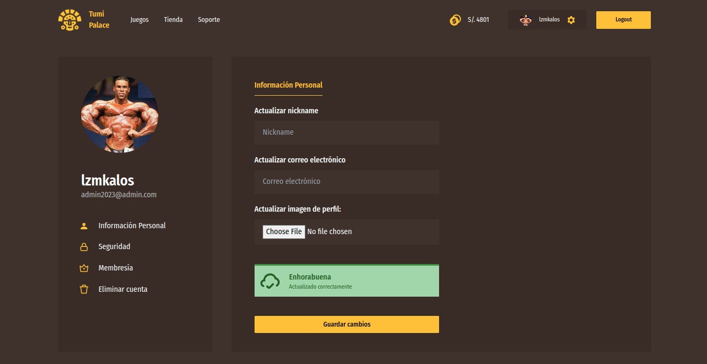
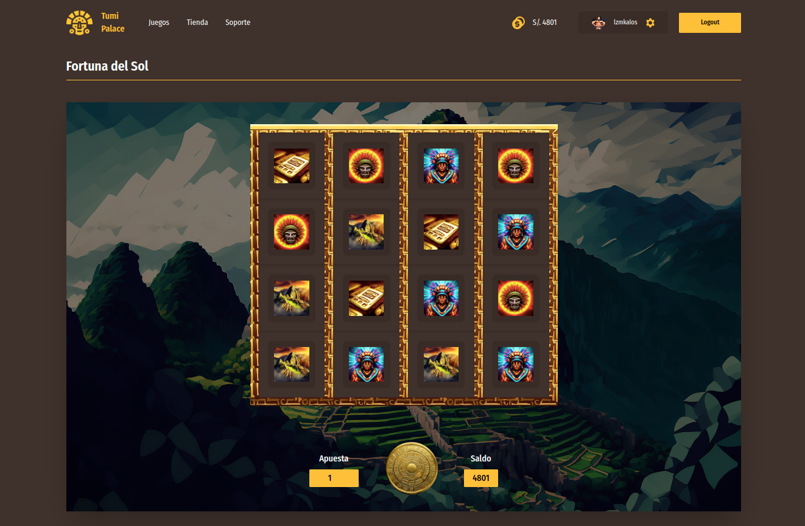

# TumiPalace Casino


## 📎 1. Descripción

<p align="justify">
TumiPalace es una aplicación web que permite a los usuarios realizar apuestas de distinta índole, su principal atractivo es la Fortuna del Sol (Tragamonedas). Este proyecto permite a los usuarios mantener sus registros, jugadas, transacciones y muchas mas opciones almacenadas desde cualquier dispositivo tanto en escritorio como en moviles y desde la simple comodidad de su casa.

En la última versión de la aplicación transladamos todo el contenido de archivos estáticos al framework Vue en su tercera versión. Esto trajo consigo una mejor estructura, velocidad y seguridad por parte de la aplicación. El backend funciona con flask y se espera escuche en el puerto $5004$, mientras que la aplicación en el puerto $8080$. Por este motivo contamos con dos carpetas `/backend`, `/frontend`, que almacena la aplicación en flas y vue 3 respectivamente.
</p>


## 2. Estructura del proyecto

### 2.1 Backend/
Dentro de esta carpeta hemos configurado toda la lógica de la parte backend, actúa como puente entre la base de datos y la aplicación frontend. En esta carpeta se encuentra el archivo `app.py` que es el encargado de ejecutar la aplicación y escuchar en el puerto $5004$.

```bash
# /backend/
flask run --port=5004
```

Por otro lado, hemos desacoplado la lógica de la aplicación en distintas carpetas, por lo que cambiar entre una rama de desarrollo a una de qa o producción es muy sencillo. 

Por otro lado, además de servir archivos de tipo imágenes y objetos, en esta sección almacenamos la lógica de distintos procesos, incluido la de los juegos, el sistema de recuperación de contraseñas y la de pagos.

Para poder usar esta implementación debes crear un archivo `.env` en tu directorio raíz, este guardará información sensible como tu `API` de stripe  de google accounts, para poder correr  el sistema de pagos y recuperación de contraseñas respectivamente. 

> **Nota:** Si se obtiene un error parecido a `CREATE EXTENSION IF NOT EXISTS "uuid-ossp";` debemos añadir la siguiente extensión dentro de nuestra base de datos en postgresql.

### 2.2 Frontend/

```bash
# /frontend
npm run serve
```

## 3. Capturas de pantalla

### 3.1 Configuración de Perfil 



### 3.2 Tragamonedas



## 4. Endpoints

### 4.1 Autenticación y usuarios

| Endpoint | Método | Descripción | Restricciones |
| --- | --- | --- | --- |
| `/api/register` | `POST` | Registra un nuevo usuario en la base de datos. | No autenticado |
| `/api/login` | `POST` | Inicia sesión en la aplicación. | No autenticado |
| `/api/users/<user_id>` | `GET` | Obtiene la información del usuario. | ID Válido |
| `/api/current_user` | `GET` | Obtiene la información del usuario actual. | ID Válido |

### 4.2 API 

| Endpoint | Método | Descripción | Restricciones |
| --- | --- | --- | --- |
| `/webhook/stripe` | `POST` | Recibe los eventos de Stripe. | Autenticado |
| `/api/users/<user_id>/change_password` | `POST` | Cambia la contraseña del usuario. | Autenticado |
| `/api/reset_password/<token>` | `POST` | Restablece la contraseña del usuario con un token válido. | Token dura 10 minutos y un solo uso. |

### 4.3 Actualización de datos

| Endpoint | Método | Descripción | Restricciones |
| --- | --- | --- | --- |
| `/api/users/<user_id>` | `DELETE` | Elimina un usuario de la base de datos. | Autenticado |
| `/api/users/add_funds` | `POST` | Añade fondos a la cuenta del usuario. | Autenticado |

### 4.2 Juegos

| Endpoint | Método | Descripción | Restricciones |
| --- | --- | --- | --- |
| `/api/games` | `GET` | Obtiene la información de todos los juegos. | Autenticado |
| `/api/roulette/bet` | `POST` | Realiza una apuesta en la ruleta. | Autenticado |
| `/api/roulette/result` | `GET` | Obtiene los resultados de la ruleta. | Autenticado |

## 5. Despliegue

Para poder usar esta implementación debes crear un archivo `.env` en tu directorio raíz, este guardará información sensible como tu `API` de stripe  de google accounts, para poder correr el sistema de pagos y recuperación de contraseñas respectivamente. Así mismo para ejecutar stripe en un servidor local es necesario instalar su CLI, revisa la documentación [aquí](https://stripe.com/docs/stripe-cli).

```bash
# ejecutar, escucha en el endpoint /webhook
stripe listen --forward-to localhost:5004/webhook
```

Por otro lado flask utiliza módulos de python, por lo que tendrás que instalar los módulos necesarios que se encuentran detallados en el fichero `requirements.txt`. Para ello puedes crear un entorno virtual con `virtualenv` o `pipenv` y ejecutar el siguiente comando.

```bash 
python -m venv venv
pip install -r requirements.txt
```

Para crear la base de datos en PostgreSQL, puedes hacerlo por medio de pgadmin u otro IDE o por psql, para ello necesitas iniciar sesión con tu usuario, suponiendo que lo hagas con postgres, el comando sería el siguiente.

```bash
sudo -u postgres psql
``` 

Ahora debes crear las base de datos y los juegos iniciales. Suponiendo la creación de una base de datos de desarrollo, necesitarás ejecutar los comandos a continuación. Mientras que si quieres tener juegos iniciales harás una consulta creándolos. El script se encuentra en `backend/scripts/newGame.py`.
    
```sql
CREATE DATABASE tumipalace_db;
```

## 6. Librerías

Para desarrollar nuestro programa necesitamos de librerías indispensables tanto en el lado frontend como backend. A continuación se detallan las librerías utilizadas en cada uno de los lados.

### 6.1 Frontend

- [Vue 3](https://v3.vuejs.org/): Framework de desarrollo web.
- [Vue Router](https://router.vuejs.org/): Enrutamiento de la aplicación.
- [Vuex](https://vuex.vuejs.org/): Almacenamiento de datos.
- [Axios](https://axios-http.com/): Cliente HTTP para Vue.
- [Tailwind CSS](https://tailwindcss.com/): Diseños rápidos y minimalistas.

### 6.2 Backend

- [Flask](https://flask.palletsprojects.com/en/2.0.x/): Framework de desarrollo web.
- [Flask-CORS](https://flask-cors.readthedocs.io/en/latest/): Permite el acceso a recursos de otros dominios.
- [Flask-JWT-Extended](https://flask-jwt-extended.readthedocs.io/en/stable/): Autenticación de usuarios.
- [Flask-Mail](https://pythonhosted.org/Flask-Mail/): Envío de correos electrónicos.
- [Flask-RESTful](https://flask-restful.readthedocs.io/en/latest/): Creación de API REST.
- [Flask-Script](https://flask-script.readthedocs.io/en/latest/): Ejecución de scripts.
- [Stripe](https://stripe.com/docs/api): Sistema de pagos.
- [SQLAlchemy](https://docs.sqlalchemy.org/en/14/): ORM para bases de datos.